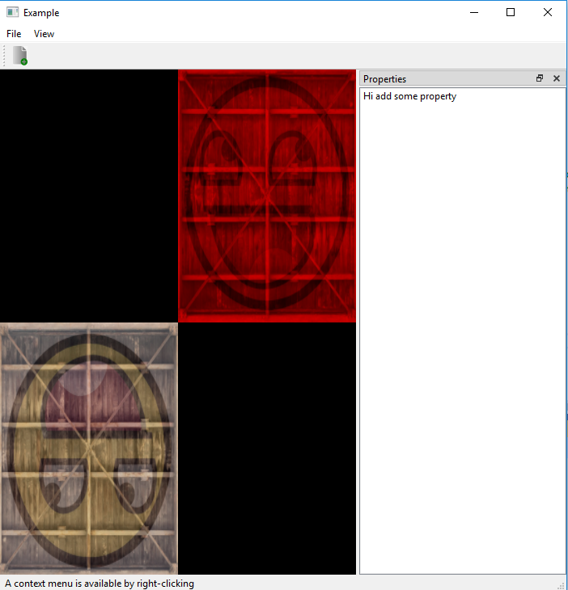

# 05_multiple_texture

Draw Two quad and blend Two texture with its color:
  1) Texture Class is written to handle the texture binding and processing
  2) one quad is drawn on first quadrant and the other is on third quadrant
  3) Two texture is loaded and blended with color of quad
  
Output Image:

References:
1) https://learnopengl.com/Getting-started/Textures
2) https://open.gl/textures
3) http://ogldev.atspace.co.uk
4) http://www.opengl-tutorial.org
